# Social Network Analysis of Yelp and Twitter Users in Urbana-Champaign Area
[Dandan Tao](https://github.com/DandanTao), Department of Food Science and Human Nutrition, University of Illinois at Urbana-Champaign

[Jiazheng Li](https://github.com/uuvkk), School of Information Sciences, University of Illinois at Urbana-Champaign

## Abstract
Social similarity is critical in the formation of friendship. The purpose of this project is to test the well-established sociological hypothesis that people tend to be similar to their friends on social media. Yelp and Twitter were chosen as platforms to collect data for network analysis. Users’ following information on Twitter and reviewing profile on Yelp are used as main characteristics for calculating similarity. Group detection was conducted on Gephi using the Louvain method. Network properties of people grouped with different similarities were compared and the impact of node property on graph property were discussed. It was found that the similarity of users who are friends are much higher than users who are not friends on both Twitter and Yelp. Interest has significant impact on network properties.

## Keywords
Network analysis; Social media; Grouping; Node similarity

## Introduction
Similarity in network analysis occurs when two nodes fall in the same group. From sociological perspective, people tend to be more similar to their friends than to people who are not their friends [2]. With massive data generated online every day, social media has been employed as a useful tool to conduct varieties of researches. Analysis of similarity helps us to detect groups with speci c interests, which is bene cial for recommendation, advertising and so on [9, 13].

Yelp is one of the most popular online review websites in the world. Most of the previous studies on Yelp dataset are based on semantic analysis of Yelp reviews for the purpose of identifying the impact of fake reviews [6], analyzing consumer dietary habits [1], and predicting user attributes [8]. A few researches have been focused on the network aspect of Yelp dataset. Gender impact on Yelp friendship network was investigated based on network analysis method triangle motifs identi cation [12]. Personalized recommender systems were proposed based on relationship heterogeneity of the information network [9, 13].

Twitter is one of the mainstream online social networking platforms, which give the users great chances to follow and know the topics and persons that interest them. Studies on Twitter user data have been widely conducted, and applied for various purposes including spam detection in user networks [10], analyzing public sentiment toward U.S. presidential election in 2012 [11], and creating alerts for cybersecurity threats and vulnerabilities [7]. In terms of grouping, clustering and communities in Twitter networks, Twitter stream is studies to build real-time systems that can find hierarchical spatiotemporal hashtag clustering for event exploration [3], community structures in Twitter social network are analyzed to predict and explain prostate and breast cancer communities [4], and spatiotemporal clustering of Twitter data are also used to infer the locations of users [5].

Though Facebook and Twitter are the two dominant tools in the field of social media analysis, increasing amount of studies have been done on Yelp due to the open Dataset Challenge. Besides, Yelp is di erent with the two prevalent social media tools in that it’s more of a review website though it also provides social functions. To our best knowledge, there is no research applying network analysis to investigate similarity of users’s preferences on di erent platforms.

The goal of this project is to test the hypothesis on virtual relationships namely friendship on Yelp and Twitter. In speci c, three network-based research questions are raised: 1) how to determine similarity; 2) how to interpret grouping results based on similarity; and 3) how does similarity in uence friendship network? To answer these questions, methods including similarity computation, grouping and metrics analysis will be employed to gain insights of node similarity and the in uence on graph property.

## Data
### Data collection
Yelp data was extracted from the [Yelp Dataset Challenge 2018](https://www.yelp.com/dataset/challenge), which includes information about local businesses in 11 metropolitan areas across 4 countries. For local purpose, location was used as the first-layer criteria for data extraction in which only “Urbana” or “Champaign” city was included for analysis. After data extraction, the useful data includes 8561 users in total. As Yelp is a local business platform and these people have reviewed restaurants in Urbana- Champaign (UC), we are assuming these people live in this speci c region. However, visitors might also review local restaurants. In addition, Yelp review data is just an estimate of people’s dining experiences and could be biased since not all people who dine out would write reviews. Therefore, the dataset we extracted would only be a rough estimation of eating behaviors of UC residencies in real life.

Twitter data were collected by [Twitter API](https://developer.twitter.com) and [TweePy library](https://github.com/tweepy). When searching for users, we use the query “Urbana Champaign” to retrieve the users. We obtain 1020 users, after filtering and pre-processing, we finally determined use 108 users and their information to generate networks and conduct analysis. The relationships of Twitter users are directed: if you follow a person, you are called a “follower” of this person, and this person is called your “friend”. The concept of our analysis is firstly built the friendship network which is directed, then build the common interest network which is undirected, and finally compute and compare the average similarity values for three di erent types of user pairs: mutual friends, single friend and non-friend relationships. We want to know, whether Twitter users in UC area tend to share more interests when they are friends than not.

### Data preprocessing
Yelp dataset: friendship information of Yelp reviewers for restaurants in Urbana-Champaign was extracted as shown below (see Figure 1). Firstly, business data was filtered by location, and only businesses in Urbana-Champaign area were extracted. Then data was further filtered by category and only “Restaurants” are extracted. Secondly, review dataset was filtered with the business ids from the last extracted restaurant dataset to extract the user ids. Lastly, user information was extracted from user dataset by filtering the user ids, and friendship information was acquired by extracting its “friend” feature. After these preprocessing, adjacency list of friendship was constructed for analysis. Here, it is reminded that the “friend” feature is mutual and un-directed. If two people are friends on Yelp, their reviews will be presented on top.

Fig. 1. Illustration of Yelp data preprocessing

Twitter dataset: using Twitter API and TweePy library, searching by query “Urbana Champaign”, we have found 1020 users. However, most of them are o cial public account for university institutes and organizations, like the screen names: “CEEatIllinois” (Department of Civil and Environmental Engineering, University of Illinois at Urbana-Champaign),
“IlliniVBall” (University of Illinois Volleyball team), and “uo admissions” (University of Illinois at Urbana-Champaign’s O ce of Undergraduate Admissions). The get_friends_ids Twitter API can give a result of 5000 ids in one page, so for better processing, we filter the users whose numbers of friends are larger than 5000; and the number of users left is 1017. Another problem of the acquired data is some of users overlap due to the feature of Twitter API. Using Python set data structure, we could easily find the unique users and the number of users becomes 287. And then we left the users that are individual user instead of public accounts, by which we have 114 users. We also get all the friends ids of the 114 users through the API, however, we found that some users set their account as private, so we remove them. Finally, we have 108 individual users and their information, and the ids of their friends. The process is shown in Figure 2.

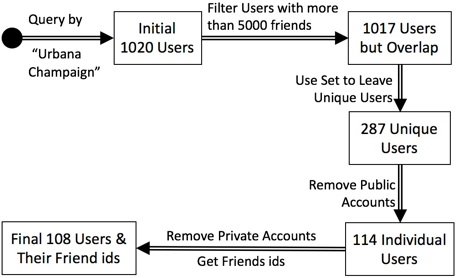

Fig. 2. Illustration of Twitter data preprocessing

## Methods
### Definition of average similarity for Yelp Users

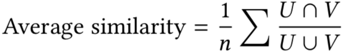

where U is the set of distinct restaurants one Yelp user reviewed, and V is the set of distinct restaurants another Yelp user reviewed. U ∩ V is the number of same restaurants a pair reviewed, and U ∩ V is the total number of distinct restaurants they reviewed.

### Definition of average similarity for Twitter Users

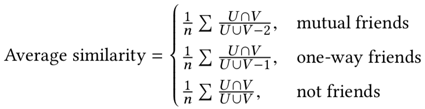

Where U is the set of friends one Twitter user follows, and V is the set of friends one Twitter another user follows. U ∩ V is the intersection of friends of a pair of users, and U ∪ V is the union of friends of a pair of users. For accurate calculation, we need to remove any of the two users form the other’s friend list. So for mutual friends, the denominator of the union need to minus 2, and for a pair with one-direction friendship, the denominator of the union must to minus
1.

### Definition of western restaurants and eastern restaurants in Yelp data
In the Yelp business dataset, each restaurant has a list of categories, from which we refer restaurants in categories of American, Mexican, or Italian as western restaurants and restaurants in categories of Chinese, Thai, Japanese, Korean, or Indian as eastern restaurants. The total number of each type of restaurants in users’ reviewing history will be recorded and the sum of western/eastern restaurants will be calculated.

### Network metrics
Node metrics to measure include degree centrality, betweenness centrality, closeness centrality, eigenvector centrality and clustering coe cient. Since the network are undirected, there is no in and out centrality measures. Graph metrics to measure include size, density, diameter, average degree and average path length.

### Visualization
Python (3.5.4) was used as the programming language to process the data and conduct network analysis. Pandas, NumPy and NetworkX were used of the main libraries for data representation, and matplotlib was used as the main library for drawling graphs. Gephi (0.9.2) was used for visualizing and grouping purposes.

## Results
### Yelp dataset analysis
Firstly, we analyzed the friendship network where node is Yelp user and edge is True if two nodes are friends. The total number of nodes in our dataset is 8561. In the friendship network, 144 components were found, for simplicity only the biggest component will be considered for analysis in the following studies. The number of nodes in this component is 2454. The network and its degree distribution are shown in Figure 3. A power-law is observed from the distribution, where most people only have one connection while only a few people have very high degree. The friendship matrix was saved as attributes for further analysis.

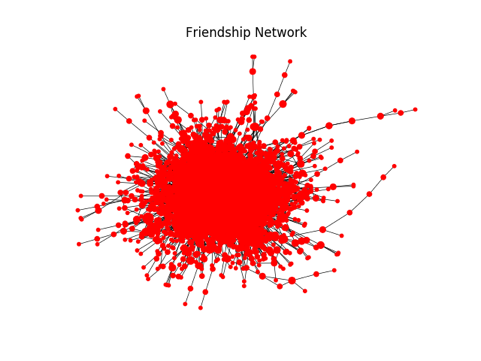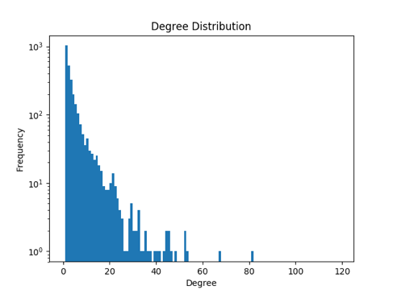

Fig. 3. Biggest component in the friendship network (left) and its degree distribution (right)

Secondly, we constructed a co-reviewing network where node is Yelp user and edge is True if two nodes reviewed at least a threshold number (n) of same restaurants. All nodes are from the biggest component found in the friendship network. To select the best parameter (n) for network analysis, we monitored the changes of network size and density along with di erent thresholds (see Figure 4).

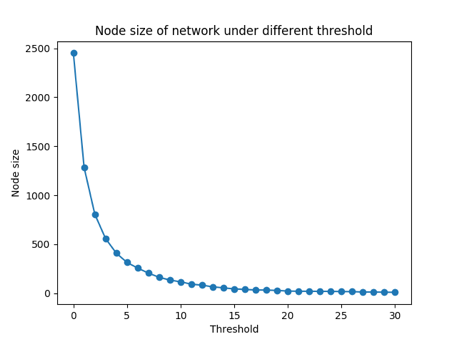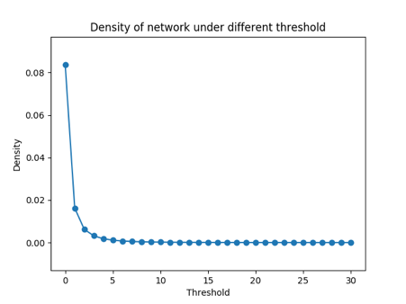

Fig. 4. Size (left) and density (right) of networks with different thresholds

A threshold of 20 (two nodes have link if they have at least 20 same restaurants reviewed) because the network under this threshold has stable size and density. There are 28 nodes in this network, the top 10 nodes of di erent centrality measures and clustering coe cient are listed (see Table 1). Node 20 is the most central node in this network. Then the network was visualized with Gephi and grouped with its modularity function (see Figure 5). 3 groups were detected based on the network structure, in which nodes in the same color indicate they are in the same group.

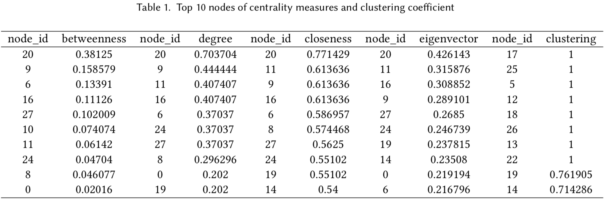

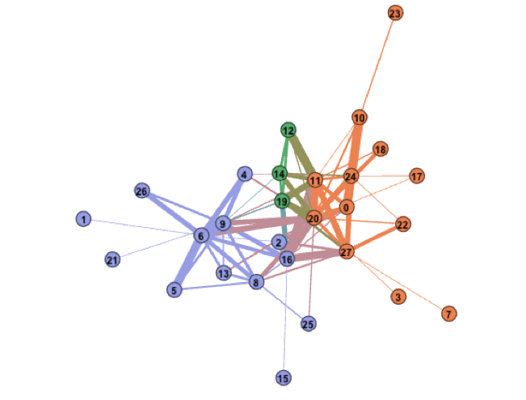

Fig. 5. Grouping of co-reviewing network using Gephi

In order to get deeper understanding of why these nodes are grouped together, we took a closer look at the 28-node network by calculating the proportion of types of restaurants each people reviewed. As shown in Figure 6, the 3 groups of people have different preferences of food. In specific, the restaurants group 0 reviewed are most diverse while the restaurants group 3 reviewed are highly skewed, and group 2 is in the middle. When looking into the summarized information of western and eastern restaurants, we are able to see that people in group 3 like to review western restaurants much more than the other two groups. In this sense, the grouping is partially attributed to peoples’s di erence in food preference.

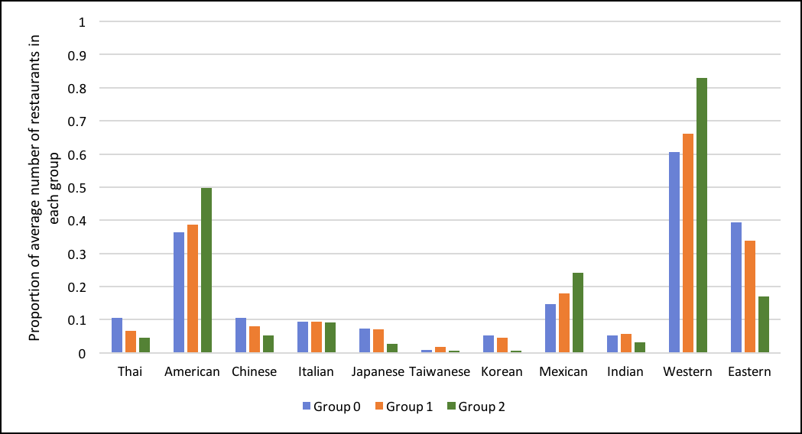

Fig. 6. Types of restaurants people reviewed in each group

In order to examine the impact of friendship on co-visiting network, we observed the number of same restaurants two people reviewed in the situation that they are either friends or not (see Figure 7). Obviously, there are more ties in non-friend network than in friend network. The distributions are similar, but It was found that people share more common restaurants when they are friends (average = 0.75) than when they are not friends (average = 0.11). In addition, the average similarity of nodes who are friends are signi cantly higher than that who are not friends (see Table 2).

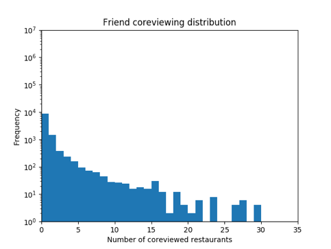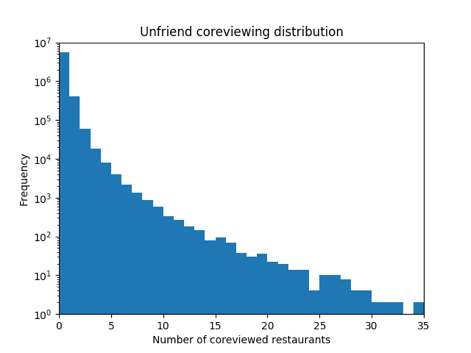

Fig. 7. Distribution of co-reviewed restaurant numbers in friend and non-friend network

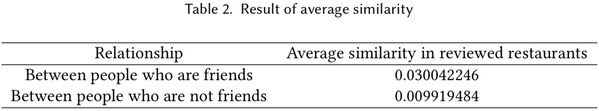

Based on previous findings, we calculated the proportion of western restaurants and eastern restaurants for each of the 2454 nodes (see Figure 8) and compared their network metrics (see Table 3). For simplicity, people whose reviewed restaurants have more than 80% western restaurants are regarded as “western food lovers”; people whose reviewed restaurants have more than 80% eastern restaurants are regarded as “eastern food lovers”; and people whose reviewed restaurants have more than 40% but less than 60% western restaurants are regarded as “people with no preference”. It was observed that the most number of people are located in the region of “people with no preference”, followed by “western food lovers” and “eastern food lovers”. However, the network of “eastern food lovers” is highest in density, which might be attributed to its size. Interestingly, highest average degree and lowest average path length are found in the network of “people with no preference”. It was indicated that people in this region are most open in making friends on Yelp.

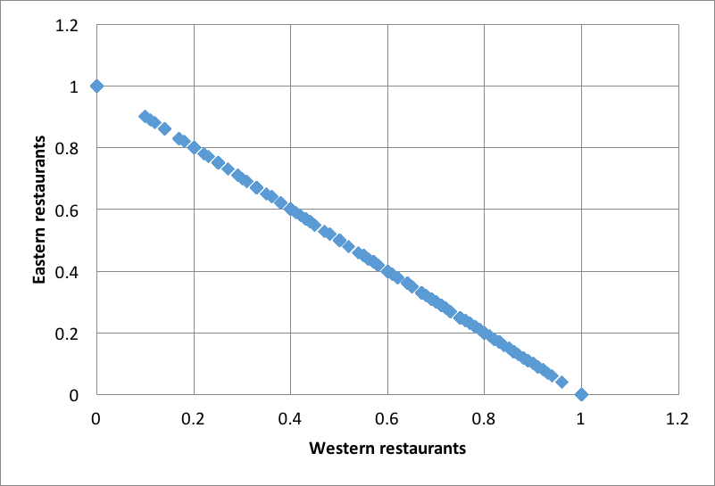

Fig. 8. Scatter of Yelp reviewers based on their food preferences

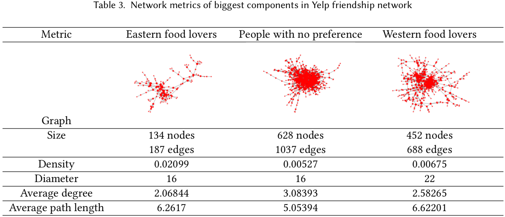

### Twitter dataset analysis
Firstly, we analyzed the friendship network where one node is a Twitter user and there is an edge form node A to node B if A follows B. The total number of nodes in our Twitter dataset is 108. Removing the isolates, the structure of the friendship network and its according degree distribution is shown in Figure 9 where the distribution also gives a power-law observation. In the directed friendship network, 30 strong components were found, and 5 weak components were found. Figure 10 shows the largest strong component and weak component. But here we only analyze the largest strongly connected component because it can be transformed to an undirected graph and is more representative and informative. Di erent metrics including centralities and clustering coe cient for the top 5 users in the largest strongly connected component are given in Table 4. We can see that the most important and active users in this network are “mstamarrian” and “ambreaxo”. “mstamarrian” is an online girl celebrity who has tweeted more than 45.3K times; and “ambreaxo” is also a girl who is in Gamma and has tweeted more than 20.4K times. It is very interesting that sororities play an important role in this community we have found, and we can conclude that sorority culture is very active on Twitter in Urbana-Champaign area.

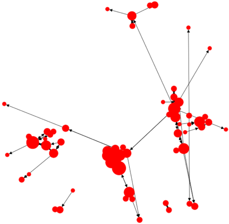 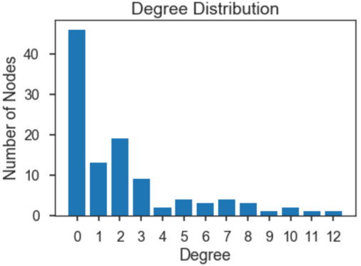

Fig. 9. Directed friendship network for Twitter users and degree distribution

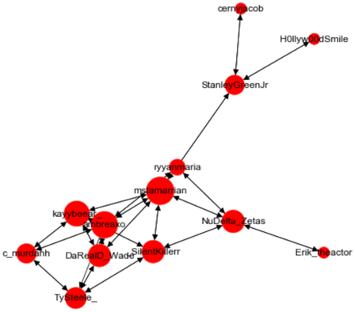 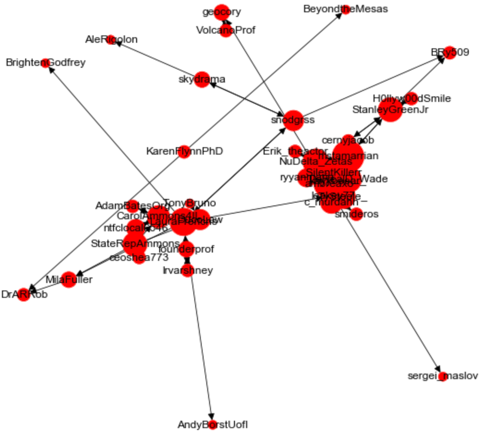

Fig. 10. Largest strongly connected component (left) and weakly connected component

In this part, we study the common friends and interests based on the 108 users and their friend information. In Figure 11, the left part shows the distribution of the numbers of friends for the 108 users, which shows a Poisson distribution, and the distribution of all the users following by the 108 users and the numbers of their followers, which shows an extreme case where the most of the followed users by the 108 users have only one follower form the 108 people, and is a de nite preferential attachment network.

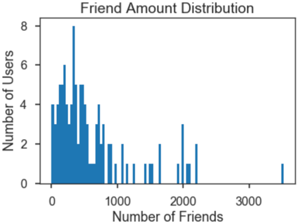 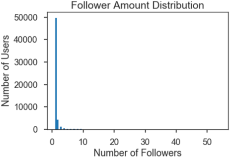

Fig. 11. Friend amount distribution and follower amount distribution

